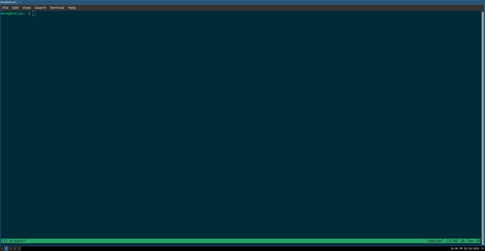

### This is my first note.

# I'm currently learning how to fix a problem with Telescope from the base install of Treesitter.
- Google search revealed on Redit that Telescope recently changed their main branch to master.
- I will add code to explicitly use [master]

# Update
- I was able to fix the issue by changing configs to config in the .config/nvim/init.lua file.
- For Treesitter section explicitly set b

````lua
branch = 'master', 
````

## Finished setting up screenshot capability on my system using scrot
- set i3 config to take a screenshot and send it to Pictures/screenshots
- activates on leader shift s




